# Guía Integral de Pruebas Locales y Validación Estructural
## (Validación con CalculiX Real, Verificación Independiente con OpenSees, Módulo de Sólidos 3D y Terminal)

Esta guía establece el protocolo unificado de pruebas, arquitectura interna y contrastación científica de los **3 módulos de la aplicación**. En ella se detalla la configuración del sistema, la ejecución de las suites de pruebas locales utilizando el solucionador nativo **CalculiX (`ccx`)**, la verificación independiente y contrastación cruzada de resultados mediante **OpenSees (`openseespy`)** para el módulo de cálculo estructural, y el flujo completo CAD/FEA para el módulo de sólidos 3D.

---

## 🏛️ 1. Arquitectura de los 3 Módulos y Roles de los Motores

La aplicación integra 3 áreas de ingeniería especializadas, donde **CalculiX (`ccx`)** actúa como el motor de cálculo físico y solucionador por elementos finitos (FEA) integrado en la aplicación, mientras que **OpenSees** se utiliza en local como motor de validación y contraste externo independiente:

| Módulo | Alcance y Funcionalidad | Motor de Cálculo en la App | Motor de Validación / Verificación |
| :--- | :--- | :--- | :--- |
| **1. Módulo Terminal** | Consola interactiva de comandos, ejecución de scripts, depuración y utilidades del sistema. | Shell interactivo / JNI (`TerminalCommandExecutor`) | Pruebas de integración de comandos del sistema (`TerminalCommandExecutorTest`, `TerminalPipelineRealExecutionTest`). |
| **2. Módulo Cálculo Estructural** | Análisis estructural 1D/2D/3D (vigas continuas, pórticos espaciales tipo SAP2000, cerchas, losas y muros cortantes), diagramas de momentos flectores ($M$), cortantes ($V$), axiales ($N$), derivas de entrepiso y reportes PDF. | **CalculiX (`ccx`)** mediante elementos de barra (`B31`, `B32`), losas (`S4R`) y muros (`CPS4`). | **Pruebas Locales:** Solucionador real **CalculiX (`ccx`)**.<br>**Verificación Independiente:** **OpenSees (`openseespy`)** y teoría analítica clásica de Resistencia de Materiales (Euler-Bernoulli y Timoshenko). |
| **3. Módulo Sólidos 3D** | Modelado CAD volumétrico continuo, operaciones booleanas, discretización y análisis FEA tridimensional de piezas mecánicas. | **CalculiX (`ccx`)** + OpenCASCADE (`DRAWEXE`) + Gmsh (`C3D10`) + Conversor C++ GLB para SceneView. | Contrastación con formulaciones elásticas tridimensionales y verificación de integridad visual en SceneView. |

```mermaid
flowchart TD
    subgraph "MÓDULO 1: TERMINAL"
        T1["Consola / Scripts"] --> T2["TerminalCommandExecutor (JNI / Shell)"]
    end

    subgraph "MÓDULO 2: CÁLCULO ESTRUCTURAL (TIPO SAP2000)"
        S1["Vigas, Pórticos 2D/3D, Cerchas, Losas"] --> S2["Ensamblado de Deck INP (B31, B32, S4R, CPS4)"]
        S2 --> S3["Motor de la App: CalculiX ccx (Solver FEA Estructural)"]
        S3 --> S4["Parseo de Resultados (.dat / .frd)"]
        S4 --> S5["Visualización 3D OpenGL ES, Diagramas M/V/N y Reporte PDF"]
        
        S2 -.->|Contrastación Cruzada e Independiente| OPS["Validador Independiente: OpenSeesPy (Python 3.11)"]
        OPS -.-> S5
    end

    subgraph "MÓDULO 3: SÓLIDOS 3D (FEA VOLUMÉTRICO CONTINUO)"
        CAD["OpenCASCADE (DRAWEXE Headless)"] --> MESH["Gmsh (Tetraedros Cuadráticos C3D10)"]
        MESH --> ASM["SolidInpAssembler (Java)"]
        ASM --> CCX["CalculiX ccx (Solucionador Sólido 3D + SPOOLES MT)"]
        CCX --> FRD["Base de Datos .frd"]
        FRD --> GLB["Parser C++ a GLB (SceneView Unlit)"]
    end
```



---

## 🛠️ 2. Preparación y Configuración del Entorno de Pruebas

Para reproducir fielmente todas las validaciones en local, se deben instalar y configurar las herramientas del sistema, CalculiX nativo y el entorno de OpenSees.

### Paso 2.1: Preparar Dependencias y Binario de CalculiX (`preparar_calculix.sh`)
CalculiX requiere bibliotecas numéricas BLAS, LAPACK, ARPACK y soporte de paralelismo multihilo OpenMP:
```bash
chmod +x preparar_calculix.sh
./preparar_calculix.sh
```
*Instala en el sistema:* `liblapack3`, `libarpack2t64` (o `libarpack2`), `libgfortran5`, `libgomp1` y compila/instala `ccx` en `~/.local/bin/ccx`.

### Paso 2.2: Preparar Entorno Aislado de OpenSees (`preparar_opensees.sh`)
Para mantener aislado el entorno sin alterar el Python global del sistema operativo, OpenSees opera en un entorno virtual con **Python 3.11**:
```bash
chmod +x preparar_opensees.sh
./preparar_opensees.sh
```
*Este script:*
1. Instala Python 3.11 y cabeceras de desarrollo mediante el PPA `deadsnakes` (`python3.11-venv`, `python3.11-dev`, `liblapack-dev`, `libopenmpi-dev`, `tcl-dev`, `tk-dev`, `libeigen3-dev`).
2. Genera el entorno virtual en `~/opensees-env`.
3. Instala `openseespy`, `numpy`, `scipy` y `matplotlib`.
4. Ejecuta un test de inicialización que certifica la correcta operatividad de OpenSees.

### Paso 2.3: Instalar Herramientas CAD, Mallador Gmsh y Compiladores
```bash
sudo apt-get update && sudo apt-get install -y \
  openjdk-17-jdk \
  g++ \
  gmsh \
  xvfb \
  occt-draw \
  libocct-draw-dev \
  libocct-visualization-dev \
  calculix-ccx
```

### Paso 2.4: Enlace Simbólico y Variables de Entorno para DRAWEXE
```bash
sudo ln -sf /usr/bin/occt-draw-7.6 /usr/bin/DRAWEXE
```

---

## ⚙️ 3. Validación y Pruebas Locales con CalculiX Real (`ccx`)

El motor de la app genera archivos `.inp` estándares que son ejecutados de manera idéntica por el solucionador **CalculiX `ccx` 2.23** con soporte multihilo **SPOOLES MT**.

### 3.1 Simulación Completa de la UI y Motor Físico (`simulate_structural_ui_and_physics.py`)
Este script reproduce exactamente la lógica de `GridEditorView` y `StructuralFragment`, resolviendo los casos estructurales directamente con el binario local de `ccx`:
```bash
python3 simulate_structural_ui_and_physics.py
```
*Casos validados con CalculiX real:*
- **Viga en Voladizo (Cantilever 4m, P = 10 kN):** Validación de flecha en punta, momentos y cortantes.
- **Viga Simplemente Apoyada (L = 6m, P = 20 kN):** Flecha central y reacciones en apoyos.
- **Pórtico Simple (Portal Frame 4x3m, F = 10 kN Lateral):** Desplazamiento lateral y derivas de entrepiso.
- **Pórtico de Dos Crujías (8x3m, F = 15 kN):** Rigidez y distribución de momentos.
- **Viga Continua Bi-tramo (2x3m):** Continuidad elástica y momentos sobre apoyos intermedios.
- **Cercha a Dos Aguas (Pitched Truss 6x4.5m con Tirante):** Esfuerzos de tracción puros en tirante `L100x10`.
- **Edificio de 3 Pisos x 2 Crujías (Patrón Sísmico Triangular):** Comprobación de deriva lateral monotónica según NSR-10 y ASCE 7-22 ($< 1.0\%$).
- **Puente de Celosía Warren 12m (15 Barras):** Simetría de deformada elástica y capacidad portante.
- **Losa Bidireccional de Concreto (4x4m, Elementos `S4R`):** Flecha fuera de plano y verificación ACI 318 ($L/360$).
- **Muro de Cortante 2D (3x3m, Elementos `CPS4`):** Análisis en tensión plana y rigidez basal.

### 3.2 Batería de Modelos y Formatos CAD/FEA (`test_all_sample_models.py`)
Ejecuta la integración continua entre OpenCASCADE (`DRAWEXE`), Gmsh y CalculiX:
```bash
python3 test_all_sample_models.py
```

### 3.3 Rendimiento y Paralelismo de CalculiX (`run_calculix_tests.sh`)
Compara el tiempo de cálculo secuencial (1 núcleo) vs paralelo (4 núcleos con SPOOLES MT):
```bash
bash run_calculix_tests.sh
```

---

## 🔬 4. Verificación Independiente del Módulo de Cálculo Estructural con OpenSees

Para garantizar la máxima confiabilidad técnica de los cálculos estructurales de la aplicación (los cuales son resueltos internamente con CalculiX), se utiliza **OpenSees** (`openseespy`) como estándar de referencia independiente de ingeniería estructural.

### 4.1 Ejecución del Script de Verificación Independiente
```bash
source ~/opensees-env/bin/activate
python validate_with_opensees.py
```

### 4.2 Benchmarks Estructurales Contrastados (CalculiX vs OpenSees vs Teoría Analítica)

#### Benchmark 1: Viga en Voladizo ($L=4\text{ m}, P=-10\text{ kN}, E=210\text{ GPa}, b=0.20\text{ m}, h=0.30\text{ m}$)
- **Flecha Teórica Euler-Bernoulli:** $\delta_{\text{tip}} = \frac{PL^3}{3EI} = 2.257496\text{ mm}$
- **OpenSees (`elasticBeamColumn`):** $2.257496\text{ mm}$ (Concordancia exacta $100.00\%$, residuo $< 10^{-14}\text{ mm}$).
- **CalculiX (`B31` Timoshenko):** $2.2753\text{ mm}$ (Incluye deformación por cortante de Timoshenko, diferencia $< 0.8\%$).
- **Reacciones en Base:** Cortante $V = 10.00\text{ kN}$, Momento $M = 40.00\text{ kN}\cdot\text{m}$ exactos en ambos solucionadores.

#### Benchmark 2: Viga Simplemente Apoyada con Carga Uniformemente Distribuida ($L=6\text{ m}, w=-15\text{ kN/m}$)
- **Flecha Central Teórica:** $\delta_{\text{mid}} = \frac{5wL^4}{384EI} = 0.949219\text{ mm}$
- **OpenSees (Discretización continua):** $0.949219\text{ mm}$ (Concordancia exacta $100\%$).
- **Reacciones Verticales:** $R_1 = R_2 = 45.00\text{ kN}$, Momento Máximo $M_{\text{max}} = \frac{wL^2}{8} = 67.50\text{ kN}\cdot\text{m}$.

#### Benchmark 3: Pórtico Espacial 3D Tipo SAP2000 (Carga Lateral $50\text{ kN}$)
- **Rigidez Tridimensional:** Desplazamiento lateral de nudos superiores convergente ($2.299\text{ mm}$).
- **Equilibrio Estático Global:** Reacción basal total en $X = -50.00\text{ kN}$ ($100\%$ de equilibrio estático verificado).

#### Benchmark 4: Cercha Articulada Isostática (Esfuerzos Axiales Puros)
- **Carga en Cúspide:** $P = -60\text{ kN}$ en $H = 3\text{ m}$, Base $= 4\text{ m}$.
- **Reacciones Verticales:** $R_1 = R_2 = 30.00\text{ kN}$ exactos.
- **Esfuerzos Axiales Internos:**
  - Barra Inferior: $F = +20.00\text{ kN}$ (Tracción pura).
  - Diagonales: $F = -36.06\text{ kN}$ (Compresión pura).

### 4.3 Validación Comparativa Integral de los 12 Presets (`validate_all_presets_calculix_opensees.py`)
Para contrastar de forma simultánea todos los ejemplos y plantillas de la app contra OpenSees:
```bash
source ~/opensees-env/bin/activate
python validate_all_presets_calculix_opensees.py
```
*Documentación y fundamentos físico-matemáticos:* Consulta **[ANALISIS_VALIDACION_ESTRUCTURAL_OPENSEES_CALCULIX.md](ANALISIS_VALIDACION_ESTRUCTURAL_OPENSEES_CALCULIX.md)** para ver la comparativa teórica detallada entre la viga de Timoshenko (`B31`) y Euler-Bernoulli (`elasticBeamColumn`).

---

## 🧊 5. Módulo de Sólidos 3D (CAD + Gmsh + CalculiX FEA + Parser GLB SceneView)

Para el análisis continuo de piezas mecánicas tridimensionales, se sigue el pipeline completo:

### Paso 5.1: Modelado CAD con OpenCASCADE (`DRAWEXE` Headless)
```bash
mkdir -p /tmp/pruebas_fea
cd /tmp/pruebas_fea

# Crear viga prismática 100x10x10 mm y exportar a STEP
echo "pload ALL; box b 100 10 10; stepwrite a b /tmp/pruebas_fea/cantilever.step; exit" | xvfb-run -a DRAWEXE
```

### Paso 5.2: Mallado Volumétrico Cuadrático con Gmsh (`C3D10`)
```bash
cat << 'EOF' > cantilever.geo
SetFactory("OpenCASCADE");
Box(1) = {0, 0, 0, 100, 10, 10};
s() = Surface In BoundingBox{-0.1, -0.1, -0.1, 0.1, 10.1, 10.1};
Physical Surface("Fixed") = s();
s2() = Surface In BoundingBox{99.9, -0.1, -0.1, 100.1, 10.1, 10.1};
Physical Surface("Loaded") = s2();
Physical Volume("Steel") = {1};
Mesh.MeshSizeMax = 2.5;
Mesh.ElementOrder = 2;
Mesh.SecondOrderLinear = 1;
Mesh.Optimize = 1;
EOF

gmsh cantilever.geo -3 -format inp -o cantilever_raw.inp
```

### Paso 5.3: Ensamblado Mecánico con `SolidInpAssembler` (Java)
```bash
javac -d . /home/danielpdiamon/Calculo_Estructural/app/src/main/java/com/diamon/civil/solids/engine/SolidInpAssembler.java

cat << 'EOF' > Launcher.java
import com.diamon.civil.solids.engine.SolidInpAssembler;
import java.io.File;

public class Launcher {
    public static void main(String[] args) throws Exception {
        File workDir = new File("/tmp/pruebas_fea");
        SolidInpAssembler.assemble(workDir, "cantilever", "Steel", 200000.0, 0.3, -100.0, 2, "X_MIN", "X_MAX");
        System.out.println("Ensamblado completado: cantilever.inp generado.");
    }
}
EOF

javac -cp . -d . Launcher.java
java -cp . Launcher
```

### Paso 5.4: Resolución FEA con CalculiX (`ccx`)
```bash
export OMP_NUM_THREADS=4
ccx -i cantilever
```

### Paso 5.5: Conversión Nativa C++ a GLB para SceneView
```bash
g++ -O3 -std=c++17 -DSTANDALONE_TEST \
    -I/home/danielpdiamon/Calculo_Estructural/app/src/main/cpp/include \
    -I/home/danielpdiamon/Calculo_Estructural/app/src/main/cpp/ \
    /home/danielpdiamon/Calculo_Estructural/app/src/main/cpp/frd_converter.cpp \
    -o /tmp/frd_converter

/tmp/frd_converter cantilever.frd cantilever.glb
```
*Especificaciones requeridas para SceneView:*
1. **Material `KHR_materials_unlit`:** Evita que sombras proyectadas distorsionen el mapa de tensiones de Von Mises.
2. **Estructura de Búferes:** Exactamente 2 `bufferViews` (índices y vértices entrelazados con `byteStride: 12`).

---

## 🧪 6. Pruebas Unitarias e Integración con Gradle

Para validar todos los módulos de código Java, C++ y parsers de salida:
```bash
./gradlew testDebugUnitTest
```
*Suites ejecutadas:*
- `StructuralPhysicsValidationTest`: Comprobación física de CalculiX real contra vigas Euler-Bernoulli, pórticos y cerchas.
- `StructuralBeamAnalysisTest`: Parseo de `.dat` y `.frd`, generación de VBOs y verificación de desplazamientos.
- `StructuralAllPresetsValidationTest`: Validación de todos los presets estructurales de la app.
- `SolidInpAssemblerTest`: Validación del ensamblador de decks `.inp` para sólidos 3D.
- `TerminalCommandExecutorTest` y `TerminalPipelineRealExecutionTest`: Pruebas del subsistema de terminal.

---

## 📦 7. Compilación Final del APK

Para compilar la versión instalable del proyecto:
```bash
./gradlew assembleDebug
```
Ubicación del ejecutable Android:
```
/tmp/calculoestructural_build/outputs/apk/debug/app-debug.apk
```
